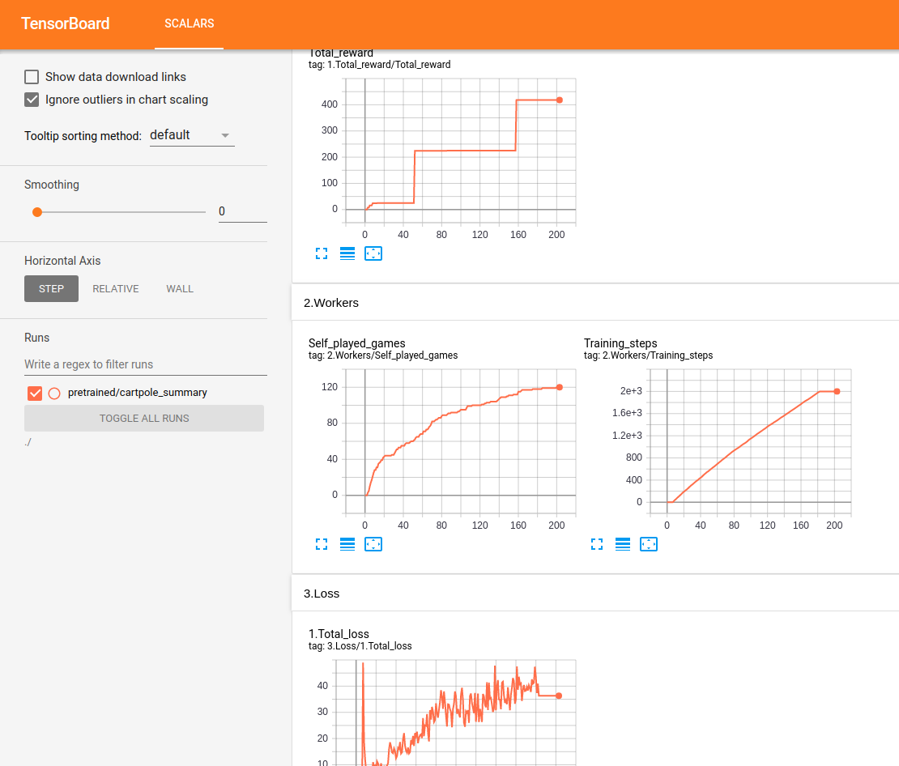
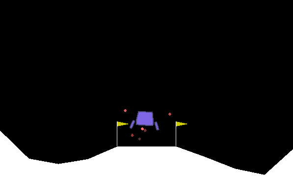
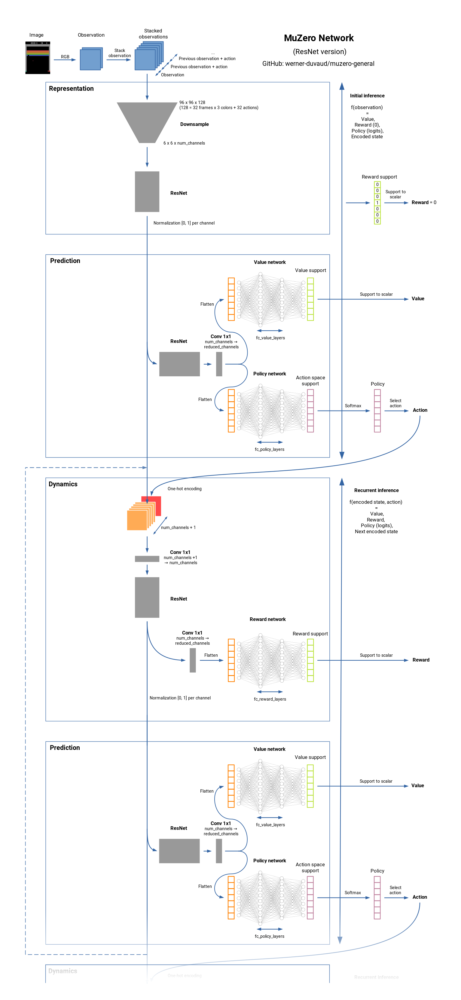
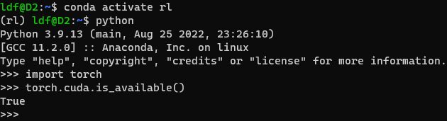
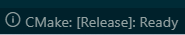

-929292)


[](https://github.com/psf/black)

[](https://discord.gg/GB2vwsF)

# MuZero General

A commented and [documented](https://github.com/werner-duvaud/muzero-general/wiki/MuZero-Documentation) implementation of MuZero based on the Google DeepMind [paper](https://arxiv.org/abs/1911.08265) (Nov 2019) and the associated [pseudocode](https://arxiv.org/src/1911.08265v2/anc/pseudocode.py).
It is designed to be easily adaptable for every games or reinforcement learning environments (like [gym](https://github.com/openai/gym)). You only need to add a [game file](https://github.com/werner-duvaud/muzero-general/tree/master/games) with the hyperparameters and the game class. Please refer to the [documentation](https://github.com/werner-duvaud/muzero-general/wiki/MuZero-Documentation) and the [example](https://github.com/werner-duvaud/muzero-general/blob/master/games/cartpole.py).

MuZero is a state of the art RL algorithm for board games (Chess, Go, ...) and Atari games.
It is the successor to [AlphaZero](https://arxiv.org/abs/1712.01815) but without any knowledge of the environment underlying dynamics. MuZero learns a model of the environment and uses an internal representation that contains only the useful information for predicting the reward, value, policy and transitions. MuZero is also close to [Value prediction networks](https://arxiv.org/abs/1707.03497). See [How it works](https://github.com/werner-duvaud/muzero-general/wiki/How-MuZero-works).

## Features

* [x] termination and truncation information [Gymnasium](https://gymnasium.farama.org/tutorials/gymnasium_basics/handling_time_limits/)
* [x] Residual Network and Fully connected network in [PyTorch](https://github.com/pytorch/pytorch)
* [x] Multi-Threaded/Asynchronous/[Cluster](https://docs.ray.io/en/latest/cluster-index.html) with [Ray](https://github.com/ray-project/ray)
* [X] Multi GPU support for the training and the selfplay
* [x] TensorBoard real-time monitoring
* [x] Model weights automatically saved at checkpoints
* [x] Single and two player mode
* [x] Commented and [documented](https://github.com/werner-duvaud/muzero-general/wiki/MuZero-Documentation)
* [x] Easily adaptable for new games
* [x] [Examples](https://github.com/werner-duvaud/muzero-general/blob/master/games/cartpole.py) of board games, Gym and Atari games (See [list of implemented games](https://github.com/werner-duvaud/muzero-general#games-already-implemented))
* [x] [Pretrained weights](https://github.com/werner-duvaud/muzero-general/tree/master/results) available

### Further improvements

These improvements are active research, they are personal ideas and go beyond MuZero paper. We are open to contributions and other ideas.

* [x] [Hyperparameter search](https://github.com/werner-duvaud/muzero-general/wiki/Hyperparameter-Optimization)
* [x] [Continuous action space](https://github.com/werner-duvaud/muzero-general/tree/continuous)
* [x] [Tool to understand the learned model](https://github.com/werner-duvaud/muzero-general/blob/master/diagnose_model.py)
* [ ] Support of stochastic environments
* [ ] Support of more than two player games
* [ ] RL tricks (Never Give Up,  Adaptive Exploration, ...)

## Demo

All performances are tracked and displayed in real time in [TensorBoard](https://www.tensorflow.org/tensorboard) :



Testing Lunar Lander :



## Games already implemented

* Cartpole      (Tested with the fully connected network)
* Lunar Lander  (Tested in deterministic mode with the fully connected network)
* Gridworld     (Tested with the fully connected network)
* Tic-tac-toe   (Tested with the fully connected network and the residual network)
* Connect4      (Slightly tested with the residual network)
* Gomoku
* Twenty-One / Blackjack    (Tested with the residual network)
* Atari Breakout

Tests are done on Ubuntu with 16 GB RAM / Intel i7 / GTX 1050Ti Max-Q. We make sure to obtain a progression and a level which ensures that it has learned. But we do not systematically reach a human level. For certain environments, we notice a regression after a certain time. The proposed configurations are certainly not optimal and we do not focus for now on the optimization of hyperparameters. Any help is welcome.

## Code structure


Network summary:

<p align="center">
<a href="docs/images/muzero-network-werner-duvaud.png">

</a>
</p>

## Getting started

### 预先准备

#### Visual Studio Code

#### WSL2

##### pygame 中文字体

[中文字体](https://github.com/liudengfeng/muzeroxq/blob/main/docs/REAMD_pygame_chinese_font.md#L4)

##### matplotlib 中文字体

[中文字体](https://github.com/liudengfeng/muzeroxq/blob/main/docs/README_matplotlib_chinese.md#L1)

#### 安装MongoDB

建议在`window`中安装
[参考文档](https://learn.microsoft.com/zh-cn/windows/wsl/tutorials/wsl-database#differences-between-database-systems)

* 在 WSL (Ubuntu 20.04) 上安装 MongoDB（版本 6.0）：

#### Anaconda

* 下载

* 安装

```
bash Anaconda3-2022.05-Linux-x86_64.sh
```

* 更新

```
conda update -n base -c defaults conda
```

#### pytorch

* 安装

```python
pip install torch torchvision torchaudio --extra-index-url https://download.pytorch.org/whl/cu116
```

* 验证



#### ray

* rl 环境

```
# Install Ray with support for the dashboard + cluster launcher
pip install -U "ray[default]"

# Install Ray with minimal dependencies
# pip install -U ray
```

### Installation

* 源代码

```bash
git clone https://github.com/liudengfeng/muzeroxq.git
cd muzeroxq
conda activate rl
```

* 安装包

```python
pip install -r requirements.txt

pip install -U tensorboard-plugin-profile
```

* 编译

1. 启动`Visual studio code`，将`Cmake`设置为`release`模式



2. 编译

3. 安装

```bash
cd muzeroxq
conda activate rl
```

```python
pip install . 

# 调试安装
# pip install -e .
```

4. 测试

```python
cd muzeroxq
pytest --html report.html
```

### Run

```bash
python muzero.py
```

To visualize the training results, run in a new terminal:

```bash
tensorboard --logdir ./results
```

### 局域网WSL2访问

目标：局域网内WSL2互访

1. 固定`WSL2`地址
编辑文件`/etc/wsl.conf`，防止没有更新IP地址，文件中包含如下内容

```
[network]
generateHosts = false
```

如不存在则新建文件`wsl.conf`，本地编辑后移动`/etc`目录下

```bash
sudo mv wsl.conf /etc/
```

2. 安装工具包

```bash
sudo apt install net-tools
```

3. 运行`powershell`脚本
以下需要以管理员身份进入`powershell`

* 设置脚本运行政策

```powershell
Set-ExecutionPolicy RemoteSigned -Scope CurrentUser
```

* 编辑脚本文件
文件名称：WSL2.ps1

```
$remoteport = bash.exe -c "ifconfig eth0 | grep 'inet '"
$found = $remoteport -match '\d{1,3}\.\d{1,3}\.\d{1,3}\.\d{1,3}';

if( $found ){
  $remoteport = $matches[0];
} else{
  Write-Output "The Script Exited, the ip address of WSL 2 cannot be found";
  exit;
}

#[Ports]

# 6379 for ray
# 40050 for redis
#All the ports you want to forward separated by coma
$ports=@(6379,40050,40051,40052);


#[Static ip]
#You can change the addr to your ip config to listen to a specific address
$addr='0.0.0.0';
$ports_a = $ports -join ",";


#Remove Firewall Exception Rules
# 移除旧的防火墙设置
Invoke-Expression "Remove-NetFireWallRule -DisplayName 'WSL2 Firewall Unlock' ";

# #adding Exception Rules for inbound and outbound Rules
Invoke-Expression "New-NetFireWallRule -DisplayName 'WSL2 Firewall Unlock' -Direction Outbound -LocalPort $ports_a -Action Allow -Protocol TCP";
Invoke-Expression "New-NetFireWallRule -DisplayName 'WSL2 Firewall Unlock' -Direction Inbound -LocalPort $ports_a -Action Allow -Protocol TCP";

for( $i = 0; $i -lt $ports.length; $i++ ){
  $port = $ports[$i];
  # 删除旧的端口转发
  Invoke-Expression "netsh interface portproxy delete v4tov4 listenport=$port listenaddress=$addr";
  # 添加新的端口转发
  Invoke-Expression "netsh interface portproxy add v4tov4 listenport=$port listenaddress=$addr connectport=$port connectaddress=$remoteport";
}
```

* 在`WSL2.ps1`文件所在目录执行

```powershell
.\WSL2.ps1
```

4. 验证

* 在`WSL2`内启动`http`服务

```python
python -m http.server 6379
```

* 本机浏览器内地址栏输入`http://localhost:6379/`，应当可看到文件目录树

* 在局域网内另外一台机器的浏览器地址栏输入`http://<服务器所在IP地址>:6379/`，如可看到同样内容，验证通过

🚨 `ray`端口配置
Ray 需要在群集中的节点之间进行双向通信。每个节点都应该打开特定的端口来接收传入的网络请求。
因此，需要在每台机器上运行上述过程。

5. `ray`本地群集

* 在每个节点安装

```
pip install -U "ray[default]"
```

* 启动头部节点

```
ray start --head --port=6379
```

* 启动工作节点

```
# 注意头部节点IP地址为windows中的IP地址，而非WSL2 IP地址
ray start --address=<head-node-address:port>
```

Start the Head Node

You can adapt the configurations of each game by editing the `MuZeroConfig` class of the respective file in the [games folder](https://github.com/werner-duvaud/muzero-general/tree/master/games).

## 运行

### 简单模型

```bash
conda activate rl
cd ~/github/muzeroxq
python main.py --op train --force --use_wandb
```

```tensorboard
tensorboard --logdir results --load_fast true
```

## Authors

* Werner Duvaud
* Aurèle Hainaut
* Paul Lenoir
* [Contributors](https://github.com/werner-duvaud/muzero-general/graphs/contributors)

Please use this bibtex if you want to cite this repository (master branch) in your publications:

```bash
@misc{muzero-general,
  author       = {Werner Duvaud, Aurèle Hainaut},
  title        = {MuZero General: Open Reimplementation of MuZero},
  year         = {2019},
  publisher    = {GitHub},
  journal      = {GitHub repository},
  howpublished = {\url{https://github.com/werner-duvaud/muzero-general}},
}
```

## Getting involved

* [GitHub Issues](https://github.com/werner-duvaud/muzero-general/issues): For reporting bugs.
* [Pull Requests](https://github.com/werner-duvaud/muzero-general/pulls): For submitting code contributions.
* [Discord server](https://discord.gg/GB2vwsF): For discussions about development or any general questions.
