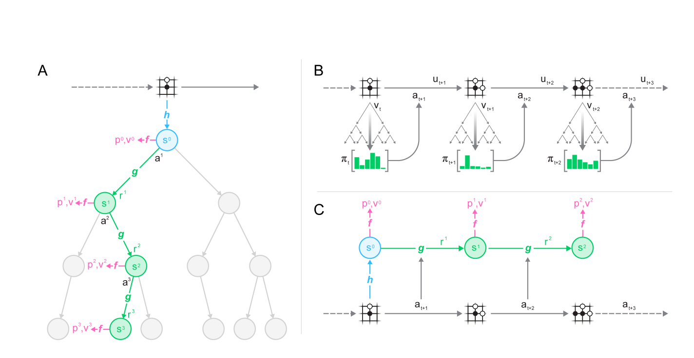
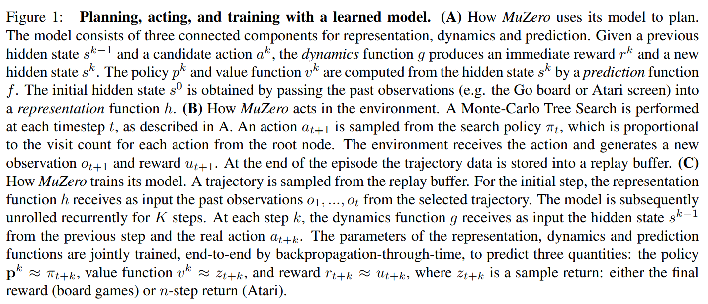
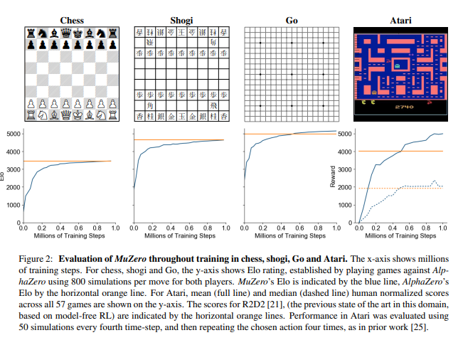
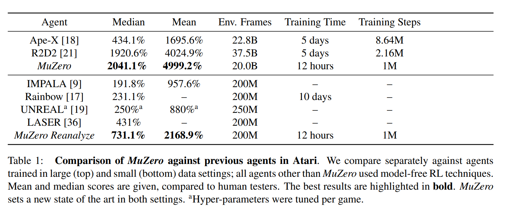
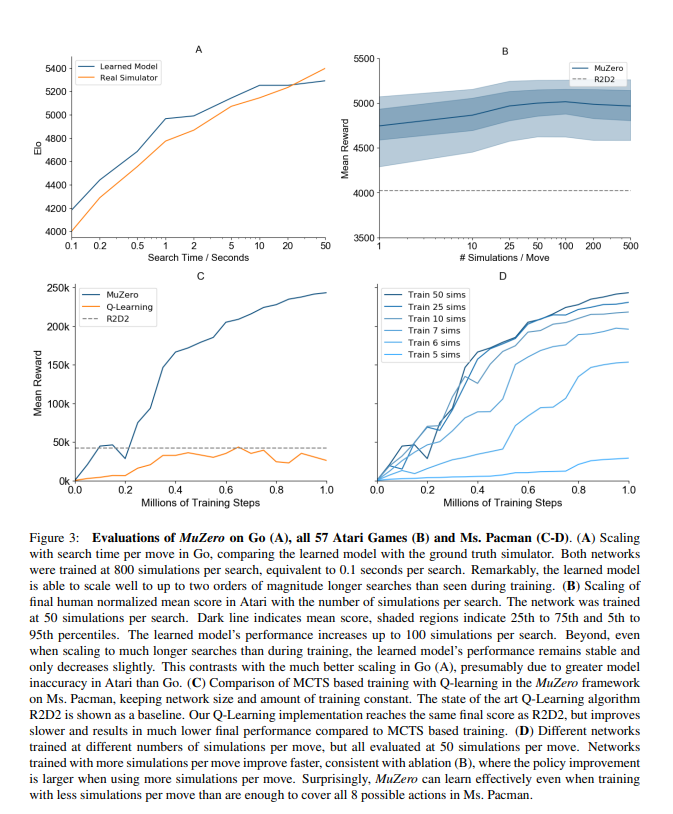

-929292)

# [MuZero](https://arxiv.org/pdf/1911.08265) 中国象棋

## 任务列表

- [x] 翻译
- [ ] 修改特征表达
- [ ] 验算$G^k$（公式 3、4）
- [ ] 验证$G^k$中$r$符号
- [ ] 验证吸收状态

## Introduction

Planning algorithms based on lookahead search have achieved remarkable successes in artificial intelligence. Human world champions have been defeated in classic games such as checkers [34], chess [5], Go [38] and poker[3, 26], and planning algorithms have had real-world impact in applications from logistics [47] to chemical synthesis [37]. However, these planning algorithms all rely on knowledge of the environment’s dynamics, such as the rules of the game or an accurate simulator, preventing their direct application to real-world domains like robotics,industrial control, or intelligent assistants.

基于前瞻搜索的规划算法在人工智能领域取得了显著成功。人类世界冠军已经在跳棋[34]，国际象棋[5]，围棋[38]和扑克[3，26]等经典游戏中被击败，计划算法在从物流[47]到化学合成[37]的应用中产生了实际影响。然而，这些规划算法都依赖于环境动态的知识，例如游戏规则或精确的模拟器，这些因素阻碍它们直接应用于机器人、工业控制或智能助手等现实世界领域。

Model-based reinforcement learning (RL) [42] aims to address this issue by first learning a model of the environment’s dynamics, and then planning with respect to the learned model. Typically, these models have either focused on reconstructing the true environmental state [8, 16, 24], or the sequence of full observations [14, 20].However, prior work [4, 14, 20] remains far from the state of the art in visually rich domains, such as Atari 2600 games [2]. Instead, the most successful methods are based on model-free RL [9, 21, 18] – i.e. they estimate the optimal policy and/or value function directly from interactions with the environment. However, model-free algorithms are in turn far from the state of the art in domains that require precise and sophisticated lookahead, such as chess and Go.

基于模型的强化学习（RL）[42]旨在通过首先学习环境动态，然后使用模型进行规划来解决这个问题。通常，这些模型要么专注于重建真实的环境状态[8，16，24]，要么专注于完整观察的序列[14，20]。然而，先前的工作[4，14，20]在视觉丰富的领域仍然远远没有达到最先进的水平，例如Atari 2600游戏[2]。相反，最成功的方法基于无模型强化学习 [9，21，18] - 即它们直接从与环境的相互作用中估计最佳策略和/或价值函数。然而，无模型算法反过来又远非需要精确和复杂前瞻性的领域的最新技术，例如国际象棋和围棋。

In this paper, we introduce MuZero, a new approach to **model-based RL** that achieves state-of-the-art performance in Atari 2600, a visually complex set of domains, while maintaining superhuman performance in precision planning tasks such as chess, shogi and Go. MuZero builds upon AlphaZero’s [39] powerful **search and search-based policy iteration algorithms**, but **incorporates a learned model into the training procedure**. MuZero also extends AlphaZero to a broader set of environments including single agent domains and non-zero rewards at intermediate time-steps.

在本文中，我们介绍了MuZero，这是一种基于模型的强化学习的新方法，可在视觉上复杂的一组域Atari 2600中实现最先进的性能，同时在国际象棋，将棋和围棋等精确规划任务中保持超人的性能。MuZero建立在AlphaZero的[39]强大的搜索和基于搜索的策略迭代算法之上，但将学习模型纳入训练过程。MuZero还将AlphaZero扩展到更广泛的环境，包括单个代理域和中间时间步的非零奖励。

The main idea of the algorithm (summarized in Figure 1) is to predict those aspects of the future that are directly relevant for planning. The model receives the observation (e.g. an image of the Go board or the Atari screen) as an input and transforms it into a hidden state. The hidden state is then updated iteratively by a recurrent process that
receives the previous hidden state and a hypothetical next action. At every one of these steps the model **predicts the policy** (e.g. the move to play), **value function** (e.g. the predicted winner), and **immediate reward** (e.g. the points scored by playing a move). The model is trained end-to-end, with the sole objective of accurately estimating these three important quantities, so as to match the improved estimates of policy and value generated by search as well as the observed reward. There is no direct constraint or requirement for the hidden state to capture all information necessary to reconstruct the original observation, drastically reducing the amount of information the model has to maintain and predict; nor is there any requirement for the hidden state to match the unknown, true state of the environment; nor any other constraints on the semantics of state. Instead, the hidden states are free to represent state in whatever way is relevant to predicting current and future values and policies. Intuitively, the agent can invent, internally, the rules or dynamics that lead to most accurate planning.

该算法的主要思想（总结在图 1 中）是预测与规划直接相关的那些未来因素。该模型接收观察结果（例如围棋板或Atari屏幕的图像）作为输入，并将其转换为隐藏状态。然后，该进程接收上一个隐藏状态和假设的下一个操作，通过循环进程迭代更新。在这些步骤中的每一个步骤中，模型都会预测策略（例如，游戏的移动），价值函数（例如预测的获胜者）和即时奖励（例如通过移动获得的分数）。该模型是端到端训练的，其唯一目标是准确估计这些三个重要数量，以便与搜索产生的政策和价值的改进估计以及观察到的奖励相匹配。隐藏状态没有直接的约束或要求来捕获重建原始观察所需的所有信息，从而大大减少了模型维护和预测的信息量;也没有任何要求隐藏状态与未知的、真实的环境状态相匹配;也没有对状态语义的任何其他约束。相反，隐藏状态可以自由地以与预测当前和未来价值和政策相关的任何方式来表示。直观地，代理可以在内部发明规则或动态，以实现最准确的规划。

## Prior Work

Reinforcement learning may be subdivided into two principal categories: model-based, and model-free [42].Model-based RL constructs, as an intermediate step, a model of the environment. Classically, this model is represented by a Markov-decision process (MDP) [31] consisting of two components: a state transition model,predicting the next state, and a reward model, predicting the expected reward during that transition. The model is typically conditioned on the selected action, or a temporally abstract behavior such as an option [43]. Once a model has been constructed, it is straightforward to apply MDP planning algorithms, such as value iteration [31] or Monte-Carlo tree search (MCTS) [7], to compute the optimal value or optimal policy for the MDP. In large or partially observed environments, the algorithm must first construct the state representation that the model should predict. This tripartite separation between representation learning, model learning, and planning is potentially problematic since the agent is not able to optimize its representation or model for the purpose of effective planning, so that, for example modeling errors may compound during planning.

A common approach to model-based RL focuses on directly modeling the observation stream at the pixellevel.It has been hypothesized that deep, stochastic models may mitigate the problems of compounding error[14, 20]. However, planning at pixel-level granularity is not computationally tractable in large scale problems.Other methods build a latent state-space model that is sufficient to reconstruct the observation stream at pixel level[48, 49], or to predict its future latent states [13, 11], which facilitates more efficient planning but still focuses the majority of the model capacity on potentially irrelevant detail. None of these prior methods has constructed a model that facilitates effective planning in visually complex domains such as Atari; results lag behind well-tuned,model-free methods, even in terms of data efficiency [45].

A quite different approach to model-based RL has recently been developed, focused end-to-end on predicting the value function [41]. The main idea of these methods is to construct an abstract MDP model such that planning in the abstract MDP is equivalent to planning in the real environment. This equivalence is achieved by ensuring
value equivalence, i.e. that, starting from the same real state, the cumulative reward of a trajectory through the abstract MDP matches the cumulative reward of a trajectory in the real environment.The predictron [41] first introduced value equivalent models for predicting value (without actions). Although the underlying model still takes the form of an MDP, there is no requirement for its transition model to match real states in the environment. Instead the MDP model is viewed as a hidden layer of a deep neural network. The unrolled MDP is trained such that the expected cumulative sum of rewards matches the expected value with respect to the real environment, e.g. by temporal-difference learning.

Value equivalent models were subsequently extended to optimising value (with actions). TreeQN [10] learns an abstract MDP model, such that a tree search over that model (represented by a tree-structured neural network) approximates the optimal value function. Value iteration networks [44] learn a local MDP model, such that value
iteration over that model (represented by a convolutional neural network) approximates the optimal value function.Value prediction networks [28] are perhaps the closest precursor to MuZero: they learn an MDP model grounded in real actions; the unrolled MDP is trained such that the cumulative sum of rewards, conditioned on the actual
sequence of actions generated by a simple lookahead search, matches the real environment. Unlike MuZero there is no policy prediction, and the search only utilizes value prediction.

+ A) 使用模型进行规划。模型包括三个组成部分：表征函数($h$)、动态函数($g$)、预测函数($f$)。1) $r^k,s^k = 动态函数 g(s^{k-1},a^k)$ 2) $p^k,v^k = 预测函数f(s^k)$
+ B) 与环境交互。每个时间步$t$完成MCTS搜索。从搜索树按政策$\pi_{t}$(与从根节点访问次数成比例)取样$a_{t+1}$，环境采取行动，产生观察$o_{t+1}$和即时奖励$u_{t+1}$，每回结束时将弹道存储在`replay buffer`。
+ C) 训练模型。从`replay buffer`中取样弹道。初始时，表征函数$h$以选中弹道中的$o_1,\dots,o_t$作为输入，模型以此展开$K$步。在$k$步，动态函数($g$)以上一步产生的$s^{k-1}$和真实的$a_{t+k}$作为输入。联合训练表征函数($h$)、动态函数($g$)、预测函数($f$)的参数，端到端进行反向传播。以此预测政策函数$p^k \approx \pi_{t+k}$，值函数$v^k \approx z_{t+k}$以及即时奖励函数$r_{t+k} \approx u_{t+k}$，此处$z_{t+k}$为取样回报：要么是最终结果(board games)，要么为`n-step return` (Atari)。

## MuZero Algorithm

We now describe the MuZero algorithm in more detail. Predictions are made at each time-step $t$, for each of
$k = 1, \ldots, K$ steps, by a model $µ_{\theta}$, with parameters $\theta$, conditioned on past observations
$o_1, \ldots, o_t$ and future actions $a_{t+1}, \ldots, a_{t+k}$. The model predicts three future quantities:
the policy $p_k^t \approx \pi(a_{t+k+1}|o_1, \ldots, o_t, a_{t+1}, \ldots, a_{t+k})$, the
value function $v_k^t \approx E[u_{t+k+1} + \gamma u_{t+k+2} + \ldots|o_1, \ldots, o_t, a_{t+1}, \ldots, a_{t+k}]$,
and the immediate reward $r_k^t \approx u_{t+k}$,where $u$ is the true, observed reward, $\pi$ is the policy used
to select real actions, and $\gamma$ is the discount function of the environment.

Internally, at each time-step $t$ (subscripts $t$ suppressed for simplicity), the model is represented by the combination of a representation function, a dynamics function, and a prediction function. The dynamics function,$r^k, s^k = g_{\theta}(s^{k−1}, a^k)$, is a recurrent process that computes, at each hypothetical step $k$, an immediate reward $r^k$ and an internal state $s^k$. It mirrors the structure of an MDP model that computes the expected reward and state transition for a given state and action [31]. However, unlike traditional approaches to model-based RL [42], this internal state $s^k$ has no semantics of environment state attached to it – it is simply the hidden state of the overall
model, and its sole purpose is to accurately predict relevant, future quantities: policies, values, and rewards. In this paper, the dynamics function is represented deterministically; the extension to stochastic transitions is left for future work. The policy and value functions are computed from the internal state $s^k$ by the prediction function,$p^k, v^k = f_{\theta}(s^k)$, akin to the joint policy and value network of `AlphaZero`. The “root” state $s^0$ is initialized using a representation function that encodes past observations, $s^0 = h_{\theta}(o_1, \ldots, o_t)$; again this has no special semantics beyond its support for future predictions.

Given such a model, it is possible to search over hypothetical future trajectories $a^1, \ldots, a^k$ given past observations
$o_1, \ldots, o_t$. For example, a naive search could simply select the $k$ step action sequence that maximizes the
value function. More generally, we may apply any MDP planning algorithm to the internal rewards and state space
induced by the dynamics function. Specifically, we use an MCTS algorithm similar to AlphaZero’s search, generalized to allow for single agent domains and intermediate rewards (see Methods). At each internal node, it makes use of the policy, value and reward estimates produced by the current model parameters $\theta$. The MCTS algorithm outputs a recommended policy $\pi_t$ and estimated value $ν_t$. An action $a_{t+1} \backsim \pi_t$ is then selected.

All parameters of the model are trained jointly to accurately match the policy, value, and reward, for every
hypothetical step $k$, to corresponding target values observed after $k$ actual time-steps have elapsed. Similarly to
`AlphaZero`, the improved policy targets are generated by an MCTS search; the first objective is to minimise the
error between predicted policy $p^k_t$ and search policy $\pi_{t+k}$. Also like AlphaZero, the improved value targets are
generated by playing the game or MDP. However, unlike AlphaZero, we allow for long episodes with discounting
and intermediate rewards by **bootstrapping $n$ steps** into the future from the search value,
$z_t = u_{t+1} + \gamma u_{t+2} + \ldots + \gamma^{n−1} u_{t+n} + \gamma^n ν_{t+n}$ . Final outcomes `{lose, draw, win}` in board games are treated as rewards $u_t \in \{−1, 0, +1\}$ occuring at the final step of the episode. Specifically, the second objective is to minimize the error between the predicted value $v^k_t$ and the value target, $z_{t+k}$. The reward targets are simply the observed rewards; the third
objective is therefore to minimize the error between the predicted reward $r^k_t$ and the observed reward $u_{t+k}$. Finally, an $L2$ regularization term is also added, leading to the overall loss:

$$
l_t(\theta) = \sum_{k=0}^{K}l^r(u_{t+k},r^k_t) + l^v(z_{t+k},v^k_t) + l^p(\pi_{t+k},p^k_t) + c \lVert \theta \rVert ^ 2
$$(1)

where $l^r$, $l^v$, and $l^p$ are loss functions for reward, value and policy respectively. Supplementary Figure S2 summarizes the equations governing how the MuZero algorithm plans, acts, and learns.

## Results

### 相关参数

+ trained MuZero for `K = 5` hypothetical steps
+ batche size 2048
+ 1 million mini-batches
+ 800 simulations
+ representation function uses **the same convolutional [23] and residual [15] architecture** as AlphaZero, but with **16 residual blocks** instead of 20
+ dynamics function uses the same architecture as the representation function
+ prediction function uses the same architecture as AlphaZero
+ All networks use **256 hidden planes**

We applied the `MuZero` algorithm to the classic board games `Go`, `chess` and `shogi`, as benchmarks for challenging planning problems, and to all 57 games in the `Atari` Learning Environment [2], as benchmarks for visually complex RL domains.

In each case we trained MuZero for `K = 5` hypothetical steps. Training proceeded for **1 million mini-batches** of size **2048 in board games** and of size 1024 in Atari. During both training and evaluation, MuZero used 800 simulations for each search in board games, and 50 simulations for each search in Atari. The representation 
function uses **the same convolutional [23] and residual [15] architecture** as AlphaZero, but with **16 residual blocks** instead of 20. The dynamics function uses the same architecture as the representation function and the prediction function uses the same architecture as AlphaZero. All networks use **256 hidden planes** (see Methods for further
details).

Figure 2 shows the performance throughout training in each game. In Go, MuZero slightly exceeded the performance of AlphaZero, despite using less computation per node in the search tree (16 residual blocks per evaluation in MuZero compared to 20 blocks in AlphaZero). This suggests that MuZero may be caching its computation in the search tree and using each additional application of the dynamics model to gain a deeper understanding of the position.

In Atari, MuZero achieved a new state of the art for both mean and median normalized score across the 57 games of the Arcade Learning Environment, outperforming the previous state-of-the-art method R2D2 [21] (a model-free approach) in 42 out of 57 games, and outperforming the previous best model-based approach SimPLe[20] in all games (see Table S1).

We also evaluated **a second version of MuZero** that was optimised for greater sample efficiency. Specifically,it **reanalyzes old trajectories by re-running the MCTS using the latest network parameters to provide fresh targets**(see Appendix H). When applied to 57 Atari games, using 200 million frames of experience per game, MuZero
Reanalyze achieved 731% median normalized score, compared to 192%, 231% and 431% for previous state-of-the-art model-free approaches IMPALA [9], Rainbow [17] and LASER [36] respectively.

To understand the role of the model in MuZero we also ran several experiments, focusing on the board game of Go and the Atari game of Ms. Pacman.

First, we tested the scalability of planning (Figure 3A), in the canonical planning problem of Go. We compared the performance of search in AlphaZero, using a perfect model, to the performance of search in MuZero, using a learned model. Specifically, the fully trained AlphaZero or MuZero was evaluated by comparing MCTS with different thinking times. MuZero matched the performance of a perfect model, even when doing much larger searches (up to 10s thinking time) than those from which the model was trained (around 0.1s thinking time, see also Figure S3A).

We also investigated the scalability of planning across all Atari games (see Figure 3B). We compared MCTS with different numbers of simulations, using the fully trained MuZero. The improvements due to planning are much less marked than in Go, perhaps because of greater model inaccuracy; performance improved slightly with search time, but plateaued at around 100 simulations. Even with a single simulation – i.e. when selecting moves solely according to the policy network – MuZero performed well, suggesting that, by the end of training, the raw policy has learned to internalise the benefits of search (see also Figure S3B).

Next, we tested our model-based learning algorithm against a comparable model-free learning algorithm (see Figure 3C). We replaced the training objective of MuZero (Equation 1) with a model-free Q-learning objective (as used by R2D2), and the dual value and policy heads with a single head representing the Q-function Q(·|st).Subsequently, we trained and evaluated the new model without using any search. When evaluated on Ms. Pacman,our model-free algorithm achieved identical results to R2D2, but learned significantly slower than MuZero and converged to a much lower final score. We conjecture that the search-based policy improvement step of MuZero provides a stronger learning signal than the high bias, high variance targets used by Q-learning.

To better understand the nature of MuZero’s learning algorithm, we measured how MuZero’s training scales with respect to the amount of search it uses during training. Figure 3D shows the performance in Ms. Pacman,using an MCTS of different simulation counts per move throughout training. Surprisingly, and in contrast to previous work [1], even with only 6 simulations per move – fewer than the number of actions – MuZero learned an effective policy and improved rapidly. With more simulations performance jumped significantly higher. For analysis of the policy improvement during each individual iteration, see also Figure S3 C and D.

## Conclusions

Many of the breakthroughs in artificial intelligence have been based on either high-performance planning [5, 38,39] or model-free reinforcement learning methods [25, 29, 46]. In this paper we have introduced a method that combines the benefits of both approaches. Our algorithm, MuZero, has both matched the superhuman performance of high-performance planning algorithms in their favored domains – logically complex board games such as chess and Go – and outperformed state-of-the-art model-free RL algorithms in their favored domains – visually complex Atari games. Crucially, our method does not require any knowledge of the game rules or environment dynamics,potentially paving the way towards the application of powerful learning and planning methods to a host of real world domains for which there exists no perfect simulator.

## Appendix A Comparison to AlphaZero

MuZero is designed for a more general setting than AlphaGo Zero [40] and AlphaZero [39].

In AlphaGo Zero and AlphaZero the planning process makes use of two separate components: a simulator implements the rules of the game, which are used to update the state of the game while traversing the search tree; and a neural network jointly predicts the corresponding policy and value of a board position produced by the simulator (see Figure 1 A).

Specifically, AlphaGo Zero and AlphaZero use knowledge of the rules of the game in three places: (1) state transitions in the search tree, (2) actions available at each node of the search tree, (3) episode termination within the search tree. In MuZero, all of these have been replaced with the use of a single implicit model learned by a neural network (see Figure 1 B):

+ State transitions: MuZero employs a learned dynamics model within its search.Under this model, each node in the tree is represented by a corresponding hidden state.$s_{k}=g(s_{k-1},a_{k})$
+ Actions available: MuZero only masks legal actions at the root of the search tree where the environment can be queried, but does not perform any masking within the search tree.This is possible because the network rapidly learns not to predict actions that never occur in the trajectories it is trained on.
+ Terminal nodes: MuZero does not give special treatment to terminal nodes and always uses the value predicted by the network. Inside the tree, the search can proceed past a terminal node - in this case the network is expected to always predict the same value. This is achieved by treating terminal states as absorbing states during training.

In addition, MuZero is designed to operate in the general reinforcement learning setting: single-agent domains **with discounted intermediate rewards** of arbitrary magnitude. In contrast, AlphaGo Zero and AlphaZero were designed to operate in two-player games with undiscounted terminal rewards of ±1.

## Appendix B Search

We now describe the search algorithm used by MuZero. Our approach is based upon Monte-Carlo tree search with upper confidence bounds, an approach to planning that converges asymptotically to the optimal policy in single agent domains and to the minimax value function in zero sum games [22].

Every node of the search tree is associated with an internal state `s` . For each action `a` from `s` there is an edge `(s, a)` that stores a set of statistics `{N(s, a), Q(s, a), P(s, a), R(s, a), S(s, a)}` , respectively representing visit counts `N` , mean value `Q` , policy `P` , reward `R` , and state transition `S` .

Similar to AlphaZero, the search is divided into three stages, repeated for a number of simulations.

1. Selection:
> Each simulation starts from the internal root state $s ^ 0$ , and finishes when the simulation reaches a leaf node $s^{l}$. For each hypothetical time-step `k = 1...l` of the simulation, an action a is selected according to the stored statistics for internal state $s^{k−1}$ , by maximizing over an upper confidence bound
$$a^{k} = \underset{a}{\operatorname{argmax}}[ Q(s,a) + P(s,a) . \frac{\sqrt{\sum_{b} N(s,b)}} {1+N(s,a)} (c_{1} + \log(\frac{\sum_{b} N(s,b)+c_{2}+1}{c_{2}}) )]$$(2)

> The constants $c1$ and $c2$ are used to control the influence of the prior $P(s, a)$ relative to the value $Q(s, a)$ as nodes are visited more often. In our experiments
where $$c_{1} = 1.25,$$ and $$c_{2} = 19652$$
For $k \lt l$, the next state and reward are looked up in the state transition and reward table $s^k = S(s^{k−1}, a^k)$,$r^k = R(s^{k−1}, a^k)$.

2. Expansion:
At the final time-step $l$ of the simulation, the reward and state are computed by the dynamics function, $r^{l},s^{l} = g_{θ}(s^{l−1}, a^l)$, and stored in the corresponding tables,$R(s^{l−1}, a^{l}) = r^{l}, S(s^{l−1}, a^{l}) = s^{l}$. The policy and value are computed by the prediction function, $p^l, v^l = f_{θ}(s^l)$. A new node, corresponding to state $s^l$ is added to the search tree. Each edge $(s^l, a)$ from the newly expanded node is initialized to ${N(s^l, a) = 0, Q(s^l, a) = 0, P(s^l, a) = p^l}$.
**Note that the search algorithm makes at most one call to the dynamics function and prediction function respectively per simulation**; the computational cost is of the same order as in `AlphaZero`.

3. Backup:
At the end of the simulation, the statistics along the trajectory are updated. The backup is generalized to the case where the environment can emit intermediate rewards, have a discount γ different from 1, and the value estimates are unbounded 3.For $k = l \ldots 0$, we form an $l − k - step$ estimate of the cumulative discounted reward,bootstrapping from the value function $v^l$,
$$
G^k = \sum_{\tau=0}^{l-1-k} {\gamma^{\tau}r_{k+1+\tau} + \gamma^{l-k}v^l}
$$(3)
> For $k = l \ldots 1$, we update the statistics for each edge $(s^{k−1}, a^k)$ in the simulation path as follows,
$$
Q(s^{k-1},a^k) := \frac {N(s^{k-1},a^k) * Q(s^{k-1},a^k) + G^k} {N(s^{k-1},a^k) + 1}
$$(4)
$$
N(s^{k-1},a^k) := N(s^{k-1},a^k) + 1
$$
> In two-player zero sum games the **value functions are assumed to be bounded within the [0, 1] interval**. This choice allows us to combine value estimates with probabilities using the `pUCT` rule.MuZero computes normalized  `Q` value estimates $\overline{Q} \in [0, 1]$ by using the minimum-maximum values observed in the search tree up to that point. **When a node is reached during the selection stage**, the algorithm computes the normalized $\overline{Q}$ values of its edges to be used in the pUCT rule using the equation below:
$$
\overline{Q}(s^{k-1},a^k) = \frac {Q(s^{k-1},a^k) - min_{s,a \in Tree}Q(s,a)} {max_{s,a \in Tree}Q(s,a) - min_{s,a \in Tree}Q(s,a)}
$$(5)

## Appendix C Hyperparameters

For simplicity we preferentially use the same architectural choices and hyperparameters as in previous work.Specifically, we started with the network architecture and search choices of AlphaZero [39]. For board games, we use the same UCB constants, dirichlet exploration noise and the same 800 simulations per search as in AlphaZero.

Due to the much smaller branching factor and simpler policies in Atari, we only used 50 simulations per search to speed up experiments. As shown in Figure 3B, the algorithm is not very sensitive to this choice. We also use the same discount (0.997) and value transformation (see Network Architecture section) as R2D2 [21].

For parameter values not mentioned in the text, please refer to the pseudocode

+ For board games, we use the same UCB constants
+ dirichlet exploration noise
+ 800 simulations per search
+ discount 0.997

## Appendix D Data Generation

To generate training data, the latest checkpoint of the network (updated every 1000 training steps) is used to play games with MCTS. In the board games Go, chess and shogi the search is run for 800 simulations per move to pick an action; in Atari due to the much smaller action space 50 simulations per move are sufficient.

For board games, games are sent to the training job as soon as they finish. Due to the much larger length of Atari games (up to 30 minutes or 108,000 frames), intermediate sequences are sent every 200 moves. In board games, the training job keeps an in-memory replay buffer of **the most recent 1 million games** received; in Atari, where the visual observations are larger, the most recent 125 thousand sequences of length 200 are kept.

During the generation of experience in the board game domains, the same exploration scheme as the one described in AlphaZero [39] is used. Using a variation of this scheme, in the Atari domain actions are sampled from the visit count distribution throughout the duration of each game, instead of just the first k moves. Moreover,the visit count distribution is parametrized using a temperature parameter $T$:

$$p_{\alpha} = \frac{N(\alpha)^{1/T}}{\sum_b N(b)^{1/T}}$$(6)

$T$ is decayed as a function of the number of training steps of the network. Specifically, for the first 500k training steps a temperature of 1 is used, for the next 250k steps a temperature of 0.5 and for the remaining 250k a temperature of 0.25. This ensures that the action selection becomes greedier as training progresses.

- [x] network updated every 1000 training steps
- [x] 800 simulations per move to pick an action
- [x] games are sent to the training job as soon as they finish
- [x] keeps an in-memory replay buffer of **the most recent 1 million games** received
- [ ] ~~first 500k training steps a temperature of 1 is used [Atari domain]~~
- [ ] ~~the next 250k steps a temperature of 0.5 [Atari domain]~~
- [ ] ~~the remaining 250k a temperature of 0.25 [Atari domain]~~

## Appendix E Network Input

### 表征函数【Representation Function】

The history over board states used as input to the representation function for Go, chess and shogi is represented similarly to AlphaZero [39]. In Go and shogi we encode the last 8 board states as in AlphaZero; in chess we increased the history to the last 100 board states to allow correct prediction of draws.

For Atari, the input of the representation function includes the last 32 RGB frames at resolution 96x96 along with the last 32 actions that led to each of those frames. We encode the historical actions because unlike board games, an action in Atari does not necessarily have a visible effect on the observation. RGB frames are encoded as one plane per color, rescaled to the range [0, 1], for red, green and blue respectively. We perform no other normalization, whitening or other preprocessing of the RGB input. Historical actions are encoded as simple bias planes, scaled as a/18 (there are 18 total actions in Atari).

#### 中国象棋特征

| 状态特征       | 平面数量 |     表达方式 | 说明                                    | 调整系数 |
| :------------- | -------: | -----------: | :-------------------------------------- | -------: |
| 红方棋子       |        7 |      one-hot | 每一类棋子在 10*9 网格对应位置标记1     |          |
| 黑方棋子       |        7 |      one-hot | 同上                                    |          |
| 小计           |       14 |              |                                         |          |
| 下一步走子方   |        1 |        float | 红方全部设为1，黑方全部设为2，否则为0.0 |      1/2 |
| 连续未吃子计数 |        1 |        float | 全部标记为连续未吃子计数                |    1/120 |
| 合计           |       16 |              | 每个平面 (10,9)                         |          |

+ $H=10$ 棋盘单元格高度
+ $W=9$ 棋盘单元格宽度
+ $T=18$ 历史堆积
+ $M=14$ 双方棋子类型数量
+ $L=3$ 附加特征信息
+ $time-steps = t - T + i$，长度为T
+ 每组平面代表某个时间步长的状态位置$t-T+1,t-T+2,\ldots,t-T+T-1,t$
+ `time-steps`小于1则设置为0

#### 中国象棋移动

| 移动特征 | 平面数量 | 表达方式 | 说明                   |
| :------- | -------: | -------: | :--------------------- |
| 红方棋子 |        1 |  one-hot | 提子对应位置1，其余为0 |
| 黑方棋子 |        1 |  one-hot | 落子对应位置1，其余为0 |
| 合计     |        2 |          | 每个平面 (10,9)        |

说明：
1. 过河兵、卒已经在棋盘上提供足够信息，所谓提升只不过是估计价值时采用，无需再编码提供特征
  
+ $time-steps = t - T + i$，长度为T
+ 每组平面代表某个时间步长的状态位置$t-T+1,t-T+2,\ldots,t-T+T-1,t$
+ `time-steps`小于1则设置为0

#### `S_t A_t`堆积特征(V1)

+ $S_t,A_t$堆积：$S_{t-18+1},A_{t-18+1},S_{t-18+2},A_{t+18+2}, \ldots, S_{t-2},A_{t-2}, S_{t-1},A_{t-1}, S_{t}$

### 动态函数【Dynamics Function】

The input to the dynamics function is the hidden state produced by the representation function or previous application of the dynamics function, concatenated with a representation of the action for the transition. Actions are encoded spatially in planes of the same resolution as the hidden state. In Atari, this resolution is 6x6 (see description of downsampling in Network Architecture section), in board games this is the same as the board size (19x19for Go, 8x8 for chess, 9x9 for shogi).

In Go, a normal action (playing a stone on the board) is encoded as an all zero plane, with a single one in the position of the played stone. A pass is encoded as an all zero plane.

In chess, 8 planes are used to encode the action. The first one-hot plane encodes which position the piece was moved from. The next two planes encode which position the piece was moved to: a one-hot plane to encode the target position, if on the board, and a second binary plane to indicate whether the target was valid (on the board) or not. This is necessary because for simplicity our policy action space enumerates a superset of all possible actions, not all of which are legal, and we use the same action space for policy prediction and to encode the dynamics
function input. The remaining five binary planes are used to indicate the type of promotion, if any (queen, knight, bishop, rook, none).

one-hot plane：仅仅一个数字表达为1，其余全部为0。棋盘类游戏以其表达坐标位置。

国际象棋（8个平面）

1. from：坐标位置标1
2. to：坐标位置标1
3. 有效标识：全部为0或1->代表有效
4. 剩余5个平面表达每种类型的提升

The encoding for shogi is similar, with a total of 11 planes. We use the first 8 planes to indicate where the piece moved from - either a board position (first one-hot plane) or the drop of one of the seven types of prisoner (remaining 7 binary planes). The next two planes are used to encode the target as in chess. The remaining binary plane indicates whether the move was a promotion or not.

将棋（11个平面）

1. from:one-hot plane
2. 7类棋子表达俘虏：7个binary planes，全部为0或1
3. 目标棋子：{to：坐标位置标1，有效标识：全部为0或1->代表有效} 共2个平面
4. 是否提升：binary plane 1个平面

In Atari, an action is encoded as a one hot vector which is tiled appropriately into planes.

## Appendix F Network Architecture

The prediction function $p^k, v^k = f_θ(s^k)$ uses the same architecture as AlphaZero: one or two convolutional layers that preserve the resolution but reduce the number of planes, followed by a fully connected layer to the size of the output.

For value and reward prediction in Atari we follow [30] in scaling targets using an invertible transform $h(x) = sign(x)(\sqrt{\lvert x \rvert + 1} − 1 + \epsilon x)$, where $\epsilon = 0.001$ in all our experiments.We then apply a transformation $\phi$ to the scalar reward and value targets in order to obtain equivalent categorical representations.We use a discrete support set of size 601 with one support for every integer between −300 and 300. Under this transformation, each scalar is represented as the linear combination of its two adjacent supports, such that the original value can be recovered by $x = x_{low} ∗ p_{low} + x_{high} ∗ p_{high}$. As an example, a target of 3.7 would be represented as a weight of 0.3 on the support for 3 and a weight of 0.7 on the support for 4. The value and reward outputs of the network are also modeled using a softmax output of size 601. During inference the actual value and rewards are obtained by first computing their expected value under their respective softmax distribution and subsequently by inverting the scaling transformation. Scaling and transformation of the value and reward happens transparently on the network side and is not visible to the rest of the algorithm.

Both the representation and dynamics function use the same architecture as AlphaZero, but with 16 instead of 20 residual blocks [15]. We use 3x3 kernels and 256 hidden planes for each convolution.

For Atari, where observations have large spatial resolution, the representation function starts with a sequence of convolutions with stride 2 to reduce the spatial resolution. Specifically, starting with an input observation of resolution 96x96 and 128 planes (32 history frames of 3 color channels each, concatenated with the corresponding 32 actions broadcast to planes), we downsample as follows:

+ 1 convolution with stride 2 and 128 output planes, output resolution 48x48.
+ 2 residual blocks with 128 planes
+ 1 convolution with stride 2 and 256 output planes, output resolution 24x24.
+ 3 residual blocks with 256 planes.
+ Average pooling with stride 2, output resolution 12x12.
+ 3 residual blocks with 256 planes.
+ Average pooling with stride 2, output resolution 6x6.

The kernel size is 3x3 for all operations.

For the dynamics function (which always operates at the downsampled resolution of 6x6), the action is first encoded as an image, then stacked with the hidden state of the previous step along the plane dimension.

### 中国象棋

+ The prediction function $p^k, v^k = f_θ(s^k)$ uses the same architecture as AlphaZero: one or two convolutional layers that preserve the resolution but reduce the number of planes, followed by a fully connected layer to the size of the output.
+ Both the representation and dynamics function use the same architecture as AlphaZero, but with 16 instead of 20 residual blocks [15]. We use 3x3 kernels and 256 hidden planes for each convolution.
+ Similar to Atari, chinese chess also has large spatial resolution, but resolution 10x9 and planes is great 291(18 history frames of 14 piece channels each, concatenated with the corresponding 18*2 actions broadcast to planes, and 3 constant planes)
+ For the dynamics function (which always operates at the downsampled resolution of 6x6), the action is first encoded as an image, then stacked with the hidden state of the previous step along the plane dimension.

## Appendix G Training

During training, the MuZero network is unrolled for K hypothetical steps and aligned to sequences sampled from the trajectories generated by the MCTS actors. Sequences are selected by sampling a state from any game in the replay buffer, then unrolling for K steps from that state.In Atari, samples are drawn according to prioritized replay
[35], with priority$P(i)=\frac{p_i^\alpha}{\sum_k p_k^\alpha}$, where $p_i=|v_i-z_i|$, $ν$ is the search value and $z$ the observed n-step return. To correct for sampling bias introduced by the prioritized sampling, we scale the loss using the importance sampling ratio $w_i = (\frac{1}{N} . {\frac{1}{P(i)}})^\beta$.In all our experiments, we set $\alpha = \beta = 1$. **For board games, states are sampled uniformly**.

Each observation $o^t$ along the sequence also has a corresponding MCTS policy $\pi^t$, estimated value $ν^t$ and environment reward $u^t$. At each unrolled step $k$ the network has a loss to the value, policy and reward target for that step, summed to produce the total loss for the MuZero network (see Equation 1). Note that, in board games
without intermediate rewards, we **omit the reward prediction loss**. For board games, we bootstrap directly to the end of the game, equivalent to predicting the final outcome; for Atari we bootstrap for n = 10 steps into the future.

To maintain roughly similar magnitude of gradient across different unroll steps, we scale the gradient in two separate locations:

+ We scale the loss of each head by $\frac{1}{K}$, where $K$ is the number of unroll steps. This ensures that the total gradient has similar magnitude irrespective of how many steps we unroll for.
+ We also scale the gradient at the start of the dynamics function by $\frac{1}{2}$. This ensures that the total gradient applied to the dynamics function stays constant.

In the experiments reported in this paper, we always unroll for K = 5 steps. For a detailed illustration, see Figure 1.

To improve the learning process and bound the activations, we also scale the hidden state to the same range as the action input (`[0, 1]`): $s_{scaled} = \frac {s − min(s)} {max(s)−min(s)}$.

All experiments were run using third generation Google Cloud TPUs [12]. For each board game, we used 16 TPUs for training and 1000 TPUs for selfplay. For each game in Atari, we used 8 TPUs for training and 32 TPUs for selfplay. The much smaller proportion of TPUs used for acting in Atari is due to the smaller number of simulations per move (50 instead of 800) and the smaller size of the dynamics function compared to the representation function.

中国象棋

+ For board games, states are sampled uniformly
+ in board games without intermediate rewards, we omit the reward prediction loss.
+ For board games, we bootstrap directly to the end of the game, equivalent to predicting the final outcome
+ scale the gradient in two separate locations
+ unroll for K = 5 steps
+ scale the hidden state to the same range as the action input (`[0, 1]`)
+ run using third generation Google Cloud TPUs
+ used 16 TPUs for training
+ 1000 TPUs for selfplay

## Appendix H Reanalyze

To improve the sample efficiency of `MuZero` we introduced a second variant of the algorithm, `MuZero Reanalyze`.`MuZero Reanalyze` revisits its past time-steps and re-executes its search using the latest model parameters,potentially resulting in a better quality policy than the original search. This fresh policy is used as the policy target for 80% of updates during MuZero training. Furthermore, a target network [25] ·, $v^{−} = f_{θ^−}(s^0)$, based on recent parameters $\theta^−$, is used to provide a fresher, stable n-step bootstrapped target for the value function,$z^t = u_{t+1} + \gamma u_{t+2} + \ldots + \gamma^{n−1}u_{t+n} + \gamma^n v^{−}_{t+n}$. In addition, several other hyperparameters were adjusted – primarily to increase sample reuse and avoid overfitting of the value function. Specifically, 2.0 samples were drawn
per state, instead of 0.1; the value target was weighted down to 0.25 compared to weights of 1.0 for policy and
reward targets; and the n-step return was reduced to n = 5 steps instead of n = 10 steps.

## Appendix I Evaluation

We evaluated the relative strength of MuZero (Figure 2) in board games by measuring the Elo rating of each
player. We estimate the probability that player $a$ will defeat player $b$ by a logistic function
`p(a defeats b)` $= (1+ 10^{c_{elo}(e(b)−e(a))})^{−1}$, and estimate the ratings `e(·)` by Bayesian logistic regression, computed by the BayesElo
program [6] using the standard constant $c_{elo} = 1/400$.
Elo ratings were computed from the results of a 800 simulations per move tournament between iterations of
MuZero during training, and also a baseline player: either Stockfish, Elmo or AlphaZero respectively. Baselinep
layers used an equivalent search time of 100ms per move. The Elo rating of the baseline players was anchored to
publicly available values [39].

In Atari, we computed mean reward over 1000 episodes per game, limited to the standard 30 minutes or 108,000 frames per episode [27], using 50 simulations per move unless indicated otherwise. In order to mitigate the effects of the deterministic nature of the Atari simulator we employed two different evaluation strategies: 30 noop random starts and human starts. For the former, at the beginning of each episode a random number of between 0 and 30 noop actions are applied to the simulator before handing control to the agent. For the latter, start positions are sampled from human expert play to initialize the Atari simulator before handing the control to the agent [27].

